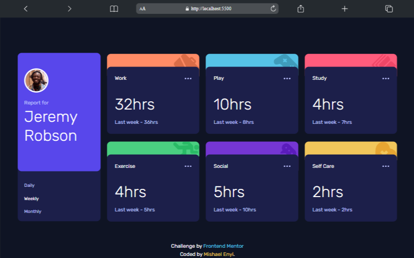

# Frontend Mentor - Time tracking dashboard solution

This is a solution to the [Time tracking dashboard challenge on Frontend Mentor](https://www.frontendmentor.io/challenges/time-tracking-dashboard-UIQ7167Jw). Frontend Mentor challenges help you improve your coding skills by building realistic projects. 

## Table of contents

- [Overview](#overview)
  - [The challenge](#the-challenge)
  - [Screenshot](#screenshot)
  - [Links](#links)
- [My process](#my-process)
  - [Built with](#built-with)
  - [What I learned](#what-i-learned)
  - [Continued development](#continued-development)
  - [Useful resources](#useful-resources)
- [Author](#author)
- [Acknowledgments](#acknowledgments)

**Note: Delete this note and update the table of contents based on what sections you keep.**

## Overview

### The challenge

Users should be able to:

- View the optimal layout for the site depending on their device's screen size
- See hover states for all interactive elements on the page
- Switch between viewing Daily, Weekly, and Monthly stats

### Screenshot

### Links

- [Solution URL](https://github.com/mishael-codes/time-tracking-dashboard-main-2)
- Live Site URL: [Add live site URL here](https://your-live-site-url.com)

## My process

### Built with

- Semantic HTML5 markup
- Flexbox
- CSS Grid
- Mobile-first workflow
- Fetch API
- Rubik (Google Fonts)

### What I learned

This project refreshed my memory on how to get and display data from an API. even though this was a dummy data from a local .json file, the principles are still the same and have helped me in other projects where I had to integrate an API and get data from it. So it's a nice refresher.

### Continued development

There is always room for improvements and what I want to do is to keep on working with API's until it becomes like writing HTML code for me, so I'm taking on more nd more projects where I have to consume an API's

## Author

- X - [@mishael_codes](https://www.x.com/mishael_codes)
- Website - [Mishael Enyi](https://mishaelenyi.netlify.app)
- Frontend Mentor - [@mishael-codes](https://www.frontendmentor.io/profile/mishael-codes)